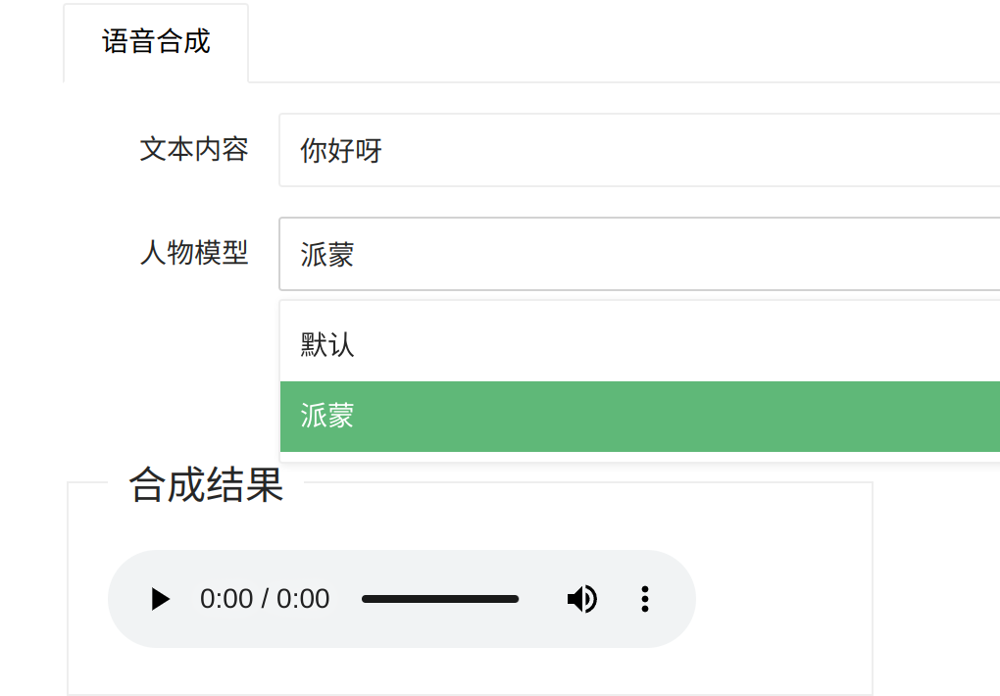

# 语音合成项目
> 原项目地址：https://github.com/AlexandaJerry/vits-mandarin-biaobei
> 
> 最原始项目：https://github.com/jaywalnut310/vits
> 
> 本项目只是添加注释和套一层web壳

## 效果展示


合成效果：
[派蒙](./source/paimon.wav)
[默认](./source/default.wav)


## 项目运行

请把模型放到model里面，然后改成 `default.pth` 即可，因为模型将近500M，实在太大，暂不提供，请自行训练

```shell
# 安装必要依赖
pip install -r requirements.txt
sudo apt-get install espeak -y
# 构建依赖
cd monotonic_align
python setup.py build_ext --inplace
cd ..
# 运行项目
python main.py
```

## 训练自己的模型

这里会分别接受如何使用标贝的数据集和使用原神游戏的数据集来进行训练

### 标贝数据集训练

因为标贝的数据集非常的标准，而且还有音频对应的文本，所以训练起来也比较简单

数据集地址：https://www.data-baker.com/data/index/TNtts

默认项目就已经配置好文本信息了，我们只需要音频文件即可，也就是`Wave`文件夹

然后我们可以软链接 `ln -s xxx/Wave vits-mandarin-biaobei/biaobei` 把数据给映射到项目中，到这里我们就可以开始训练了

训练代码在`vits-mandarin-biaobei`里，同时这个文件夹就是原项目代码，你也可以自己手动克隆项目
```shell
# 安装必要依赖
pip install -r requirements.txt
sudo apt-get install espeak -y
# 安装一下音频处理工具
sudo apt-get install -y sox
# 进入音频文件夹
cd voice
# 对原始音频进行处理，把采样率转换为22050（这里需要把下面的代码写到shell脚本里去）
for x in ./*.wav
do 
  b=${x##*/}
  sox $b -r 22050 tmp_$b
  rm -rf $b
  mv tmp_$b $b
done
# 还需要再构建一下依赖
cd ../monotonic_align
python setup.py build_ext --inplace
cd ..
# 对原始数据进行处理，后续训练是拿处理后的数据来训练的（原项目已经处理过了，可以不处理）
python preprocess.py --text_index 1 --text_cleaners chinese_cleaners1 --filelists filelists/train_filelist.txt filelists/val_filelist.txt
# 开始训练
python train.py -c configs/biaobei_base.json -m biaobei_base
```
训练完后的模型会在`logs`里


## 相关问题
### sndfile library not found

```shell
apt-get install -y libsndfile1
```